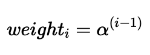
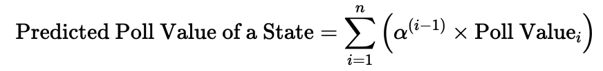

# Introduction

In this final blog post, published two days before the election (Sunday Nov 3), I am going to explain how I prepared my final model and the results derived from it.

Before I do so, however, I want to share what is perhaps my main takeaway from this class thus far:

Predicting elections is **hard**.

In many ways, it is a somewhat impossible task. Forecasting elections is not difficult because procuring data is challenging or because training models is computationally expensive; rather, predicting the outcomes of US elections is fundamentally hard because there are relatively few elections from which we can construct our models.

Since (and including) the United States' first election in 1789, there have been a grand total of [59 presidential elections (270 To Win)](https://www.270towin.com/historical-presidential-elections/). This means we only have 59 outcomes from which we can identify patterns and create a model to predict the two-party vote share at the national level. Once we consider that polling data only goes as far back as 1968, we are left with only 14 elections from which to base our models. While it could be tempting to believe that we actually have closer to 14 times 50 elections, or 700 elections, from which to make our models (if we used the election results from each state), this isn't quite the case. Polling can be expensive, so generally, state-level polling studies are conducted in more competitive states, and we may not have sufficient polling data to produce models for all of our states in every election cycle. For this reason, we have relatively few outcomes, especially in recent years, from which we can produce models. This is an issue because, with limited testing data, we run the risk of overfitting, creating models that generalize poorly.

Though outcome data is a significant limitation, the same cannot be said of covariate data. Through lab sections, we have explored voter file data sets, turnout data sets, demographic data sets, macroeconomic data sets, polling data sets, campaign spending data sets, campaign event data sets, and other data sets on political fundamentals (incumbent candidate, June approval rate, etc.). There is an incredible volume of predictors that we could theoretically include in our model (national unemployment rate, mean polling averages, lagged vote share, etc.) We could even imagine breaking down these predictors: should we include the latest week's polling average by state, or the latest month's, or the average in the last year? Over the past several weeks, we have also explored a variety of regression tools including OLS, Bayesian priors, logistic regression, LASSO and Ridge, and other machine learning models. 

One approach to handling this overabundance of covariate data and the various regression modelling techniques at our disposal is to use all of the outcome and predictor data that we possess, and then use cross-validation to determine which permutation of covariate features and machine learning models yields the lowest RMSE for predicting these outcomes. While this is tempting, it is also likely to produce a very complicated model that is highly sensitive to decisions in the validation process:

- Do we equally weight the model's ability to predict the winner of each state in each election year? Or do we weigh more recent elections more heavily? States with more electoral votes? More competitive states? States with more polls? How many polls must a state have for us to include it as an observation in our testing data set? Are all polls equally valid, or should we weigh them by their credibility?

- Do we believe that Americans vote differently now from how they would have in decades past? Are voters less likely to vote for a candidate of a different party now than in the past? Do voters consider either candidate incumbent in 2024? Are voters more responsive to unemployment and inflation in some years compared to others?

For something that, at face value, might seem like a scientific prediction problem, the process of constructing a 2024 election forecast is, in my opinion, in many ways, a subjective art. We are making assumptions about voter behavior that could actually vary across years.

Given how much space there is for bias, I want to keep this model as simple as possible. This choice is a bold one, but I want to test how well a model with few covariates compares to other classmates' more complex models models.

*The code used to produce these visualizations is publicly available in my [github repository](https://github.com/grantbw4/election-blog) and draws heavily from the section notes and sample code provided by the Gov 1347 Head Teaching Fellow, [Matthew Dardet](https://www.matthewdardet.com/harvard-election-analytics-2024/).*

# My Model 

Both [Sabato's Crystal Ball](https://centerforpolitics.org/crystalball/2024-president/) of the Center for Politics and the [Cook Political Report](https://www.cookpolitical.com/ratings/presidential-race-ratings) list the same seven states as "toss-ups." Almost universally across news platforms and forecasting models, the following seven states are identified as the key swing states which will, most likely, determine the election:

- Arizona
- Georgia
- Michigan
- Nevada
- North Carolina
- Pennsylvania
- Wisconsin

Interestingly, both of these preeminent forecasting websites, as of November 3rd, do not rank a single state as either lean Republican or lean Democrat. There are only "solid"s, "likely"s, and "toss-up"s. Thus, for the purposes of both this week's final prediction, I will forecast the two-party vote share in each of these battleground states and assume other states and districts vote as they did in 2020.

This gives us the following initial electoral college map:

```{r, include = FALSE, warning = FALSE, message = FALSE, results = 'asis'}
rm(list = ls())
cat("\014")
# Load libraries.
## install via `install.packages("name")`
library(car)
library(caret)
library(CVXR)
library(foreign)
library(glmnet)
library(haven)
library(janitor)
library(kableExtra)
library(maps)
library(mlr3)
library(randomForest)
library(ranger)
library(RColorBrewer)
library(sf)
library(tidyverse)
library(viridis)
library(glmnet)
library(maps)
```

```{r, include = FALSE, warning = FALSE, message = FALSE, results = 'asis'}

# Electoral Map 

# Load Map
us_map <- map_data("state")

# Only want 2024 info and we're making things lowercase
d_ec <- read_csv("corrected_ec_1948_2024.csv") %>% filter(year == 2024) %>% mutate(state = tolower(state))

# Add in electoral info
us_map <- us_map %>% left_join(d_ec, by = c("region" = "state"))

# used ChatGPT to get this list of states

voting_results <- data.frame(
  state = c(
    "Alabama", "Alaska", "Arizona", "Arkansas", "California", 
    "Colorado", "Connecticut", "Delaware", "District of Columbia", "Florida", 
    "Georgia", "Hawaii", "Idaho", "Illinois", "Indiana", 
    "Iowa", "Kansas", "Kentucky", "Louisiana", "Maine", 
    "Maryland", "Massachusetts", "Michigan", "Minnesota", "Mississippi", 
    "Missouri", "Montana", "Nebraska", "Nevada", "New Hampshire", 
    "New Jersey", "New Mexico", "New York", "North Carolina", 
    "North Dakota", "Ohio", "Oklahoma", "Oregon", "Pennsylvania", 
    "Rhode Island", "South Carolina", "South Dakota", "Tennessee", 
    "Texas", "Utah", "Vermont", "Virginia", "Washington", 
    "West Virginia", "Wisconsin", "Wyoming"
  ),
  party = c(
    "Republican", "Republican", "Toss Up", "Republican", "Democrat", 
    "Democrat", "Democrat", "Democrat", "Democrat", "Republican", 
    "Toss Up", "Democrat", "Republican", "Democrat", "Republican", 
    "Republican", "Republican", "Republican", "Republican", "Democrat", 
    "Democrat", "Democrat", "Toss Up", "Democrat", "Republican", 
    "Republican", "Republican", "Republican", "Toss Up", "Democrat", 
    "Democrat", "Democrat", "Democrat", "Toss Up", 
    "Republican", "Republican", "Republican", "Democrat", "Toss Up", 
    "Democrat", "Republican", "Republican", "Republican", 
    "Republican", "Republican", "Democrat", "Democrat", "Democrat", 
    "Republican", "Toss Up", "Republican"))

# Add in party info
voting_results <- voting_results %>% mutate(state = tolower(state))

voting_results %>% left_join(d_ec %>% select(state, electors), by = "state")

us_map <- us_map %>% left_join(voting_results, by = c("region" = "state"))

# Fix DC 
us_map <- us_map %>%
  mutate(party = ifelse(region == "district of columbia", "Democrat", party))

```

```{r, echo = FALSE, warning = FALSE, message = FALSE, results = 'asis'}

# Plot Electoral College Map

# I used Chat GPT to help produce these graphs

ggplot(data = us_map, aes(x = long, y = lat, group = group, fill = factor(party))) +
  geom_polygon(color = "black") +
  theme_minimal() +
  coord_fixed(1.3) +
  scale_fill_manual(values = c("Democrat" = "dodgerblue4", "Republican" = "firebrick1", "Toss Up" = "beige")) +
  labs(title = "2024 Base Electoral College Map", x = "", y = "", caption = "Hawaii is blue \nAlaska is red \nNebraska 2nd district is blue \nMaine's 2nd district is red", fill = "Party") +
  theme(
    panel.grid.major = element_blank(), 
    panel.grid.minor = element_blank(),
    axis.text = element_blank(),
    axis.ticks = element_blank()
  )

voting_results <- voting_results %>%
  left_join(d_ec %>% select(state, electors), by = "state")

df_2024 <- voting_results %>%
  group_by(party) %>%
  summarise(electoral_votes = sum(electors, na.rm = TRUE)) %>%
  mutate(party = factor(party, levels = c("Democrat", "Toss Up", "Republican")))

# Plot Electoral College Chart

ggplot(df_2024, aes(x = "", y = electoral_votes, fill = party)) +
  geom_bar(stat = "identity", width = .8) +
  geom_text(aes(label = electoral_votes), position = position_stack(vjust = 0.5), color = "black", size = 5) +
  scale_fill_manual(values = c("Democrat" = "dodgerblue4", "Toss Up" = "beige", "Republican" = "firebrick1")) +
  coord_flip() +
  theme_void() +
  theme(legend.position = "right", plot.title = element_text(hjust = 0.5)) + 
  labs(fill = "Party", title = "2024 Presidential Electoral College Base Prediction") +
  scale_y_continuous(limits = c(0, 538)) +
  geom_hline(yintercept = 270, color = "black", linetype = "dashed")

```

# Preparing My Electoral College Model

Using national-level polling average data since 1968 from [FiveThirtyEight](https://projects.fivethirtyeight.com/polls/), I will construct a model that uses the following polling features to predict the national two-party vote share.

- Polling average for the Republican candidate within a state in each of the ten most recent weeks
- Polling average for the Democratic candidate within a state in each of the ten most recent weeks

I am opting to only consider the polling averages within the last ten weeks of the campaign rather than the entirety of the campaign as I believe these to be most predictive of the ultimate election outcome. I am concerned that introducing averages from earlier periods would lead to overfitting, and, considering the unique candidate swap of 2024, I do not believe Biden nor Harris's polling averages from the stage in the election before Harris could establish a proper campaign strategy are informative. These averages also occur after both parties have held their respective conventions and show the leanings of a more settled electorate. I will also be rescaling all polling averages so that the two-party vote share sums to 100. After doing this, I will only use Democratic polls to create a model (which is possible because Republican two-party vote share is just 100 - Democratic two-party vote share).

While there are a number of fundamental and economic covariates I considered exploring (whether a candidate is only a party incumbent, GDP growth in the second quarter of the election year, RDPI growth in the second quarter of the election year, unemployment rate in the second quarter of the election year, June approval rating, etc.), I found that my forecasts were highly variable depending on which fundamental variables I decided to include. It is my belief that many of the trends explained by fundamental variables (incumbency bias, high growth is good for candidates, high inflation is bad for candidates, etc.) is already baked into the polls, so I will focus on constructing a polls-only model.

We will train a two-party vote share model for to predice Democratic vote share, and then apply this model to our 2024 data to generate predictions. 

First, I want to assess whether modern national polls are systematically more accurate than older polls.

```{r, include = FALSE, warning = FALSE, message = FALSE, results = 'asis'}

####----------------------------------------------------------#
#### Read, merge, and process data.
####----------------------------------------------------------#

# Read popular vote datasets. 
d_popvote <- read_csv("popvote_1948_2020.csv")

# Read polling data. 
d_polls <- read_csv("national_polls_1968-2024.csv")

# Process state-level polling data. 
d_pollav <- d_polls |>
  filter(weeks_left <= 10 & weeks_left >= 1) |>  # Consider only the last 12 weeks
  group_by(year, party, weeks_left) |>  # Group by year, party, and weeks_left
  summarize(
    weekly_pollav = mean(poll_support, na.rm = TRUE)  # Calculate weekly average
  ) |> 
  pivot_wider(names_from = party, values_from = weekly_pollav, names_prefix = "pollav_week")

# Rescale so that averages add up to 100
d_pollav <- d_pollav %>% mutate(
  pollav_weekDEM = pollav_weekDEM * (100 / (pollav_weekDEM + pollav_weekREP)),
  pollav_weekREP = 100 - pollav_weekDEM) %>% select(-pollav_weekREP)

# Make 10 different columns 

d_pollav <- d_pollav %>%
  pivot_wider(
    names_from = weeks_left, 
    values_from = pollav_weekDEM, 
    names_prefix = "pollav_DEM_week"
  )
```

```{r, include = FALSE, warning = FALSE, message = FALSE, results = 'asis'}

# Merge data.
d <- d_pollav %>%
  left_join(d_popvote %>% filter(party == "democrat") %>% rename(D_pv2p = pv2p) %>% select(year, D_pv2p), by = "year") %>%
  ungroup()

d_train <- d |> 
  filter(year < 2024)
d_test <- d |> 
  filter(year == 2024)
```

```{r, echo = FALSE, warning = FALSE, message = FALSE, results = 'asis'}

# Calculate the error
d_train$error <- d_train$pollav_DEM_week1 - d_train$D_pv2p

# Plot the error
ggplot(d_train, aes(x = year, y = error)) +
  geom_col(color = "black") +
  labs(
    title = "Democratic Polling Error (Latest Poll Average - Actual Two-Party Vote Share)",
    x = "Year",
    y = "Error"
  ) +
  theme_minimal() +
  theme(legend.position = "none")

```

Because the year with the highest polling error was the first year in which polls were conducted in our data set, there is reason to think the science of polling was still developing. Since this outlier could skew the results of our regression and is plausibly not representative of current possibilities, I feel comfortable removing the year 1968 from our sample. Otherwise, the polling errors look reasonably uncorrelated with time.

```{r, include = FALSE, warning = FALSE, message = FALSE, results = 'asis'}

d_train <- d_train %>% filter(year != 1968)

```

Now, I want to find the optimal way to average my week by week polling averages into an overall estimate for the national two-party Democratic vote share. Intuitively, I can assume that more recent polls are more accurate than less recent polls. I can model the weight of each column (week 1 through 10) with a decay factor, alpha, that compounds exponentially each week further away from week 1 that I get. 



I will test all decay value within the set of {1, 0.99, 0.98,..., 0.51, 0.5}.

For each decay value, I will use leave-one-out cross validation to calculate the overall RMSE of a linear regression that estimates the two-party Democratic vote share using the weighted average vote share from each election cycle except the cycle that is currently being left out.

This process yields the following RMSE graph. As we can see, 0.78 is the optimal decay value. On average, this decay value led to an OLS linear regression model with an error of out-of-sample error of roughly 1.6 percentage points.

```{r, echo = FALSE, warning = FALSE, message = FALSE, results = 'asis'}

# I used ChatGPT to help create this LOOCV process

# Define a range of alpha values to test (decay factors)
alpha_values <- seq(0.5, 1, by = 0.01)  # Adjust this range as needed

# Set up a data frame to store RMSE for each alpha
results <- data.frame(alpha = numeric(), rmse = numeric())

# Define response variable (y)
y <- d_train$D_pv2p  # Democratic two-party vote share

# Loop through each alpha value
for (alpha_value in alpha_values) {
  
  # Set up to store predictions for LOOCV
  predictions <- numeric(length = nrow(d_train))
  
  # Calculate decay weights for the current alpha
  decay_weights <- alpha_value^(0:9)  # Decay weights from week 1 to week 10
  
  # Loop for LOOCV: Leave one observation out each time
  for (i in 1:nrow(d_train)) {
    
    # Split data: leave one observation out
    train_data <- d_train[-i, ]
    test_data <- d_train[i, , drop = FALSE]
    
    # Apply decay weights to training data and calculate a single weighted predictor
    X_train <- as.matrix(train_data[, grep("pollav_DEM_week", names(train_data))]) %*% decay_weights
    X_test <- as.matrix(test_data[, grep("pollav_DEM_week", names(test_data))]) %*% decay_weights  # Ensure X_test is a single value
    
    # Convert X_train and X_test to data frames
    train_data$weighted_polling <- X_train  # Single weighted average for training
    test_data$weighted_polling <- X_test  # Single weighted average for testing
    
    # Fit a linear model on the training data with the weighted predictor
    model <- lm(D_pv2p ~ weighted_polling, data = train_data)
    
    # Predict for the left-out observation
    predictions[i] <- predict(model, newdata = test_data)
  }
  
  # Calculate RMSE for this alpha value
  rmse <- sqrt(mean((predictions - y)^2))
  
  # Store the RMSE for this alpha
  results <- rbind(results, data.frame(alpha = alpha_value, rmse = rmse))
}

optimal_alpha <- results %>% filter(rmse == min(rmse)) %>% pull(alpha)

```

```{r, echo = FALSE, warning = FALSE, message = FALSE, results = 'asis'}

# Create the plot
ggplot(results, aes(x = alpha, y = rmse)) +
  geom_line(color = "black", size = 1) +
  geom_point(color = "red", size = 2) +
  labs(
    title = "RMSE by Decay Factor (Alpha)",
    x = "Alpha",
    y = "RMSE"
  ) +
  geom_vline(xintercept = optimal_alpha, linetype = "dashed", color = "blue") +
  theme_minimal()

```

This yields the following weights for each week before the election:

```{r, echo = FALSE, warning = FALSE, message = FALSE, results = 'asis'}

weeks <- 1:10
optimal_alpha <- 0.78

# Create a data frame with each column representing optimal_alpha^(0:9)
data.frame(
  weeks,
  Weight = optimal_alpha^(0:9)) %>%
  kable(col.names = c("Weeks Left Until Election", "Weight")) %>%
  kable_styling("striped", full_width = FALSE)

```

The mean In-Sample RMSE is 1.410265.
The mean Out-of-Sample squared error is 2.626053.

```{r, echo = FALSE, warning = FALSE, message = FALSE, results = 'asis'}

# I used ChatGPT to get this table

# Define a data frame to store in-sample and out-of-sample errors for each fold
errors <- data.frame(Fold = integer(), In_Sample_RMSE = numeric(), Out_of_Sample_SE = numeric())

# Define response variable (y)
y <- d_train$D_pv2p  # Democratic two-party vote share

# Loop through each fold
for (i in 1:nrow(d_train)) {
  
  # Split data: leave one observation out
  train_data <- d_train[-i, ]
  test_data <- d_train[i, , drop = FALSE]
  
  # Calculate decay weights for the optimal alpha
  decay_weights <- optimal_alpha^(0:9)
  
  # Apply decay weights to training and testing data
  X_train <- as.matrix(train_data[, grep("pollav_DEM_week", names(train_data))]) %*% decay_weights
  X_test <- as.matrix(test_data[, grep("pollav_DEM_week", names(test_data))]) %*% decay_weights
  
  # Convert X_train and X_test to data frames
  train_data$weighted_polling <- X_train  # Single weighted average for training
  test_data$weighted_polling <- X_test  # Single weighted average for testing
  
  # Fit a linear model on the training data with the weighted predictor
  model <- lm(D_pv2p ~ weighted_polling, data = train_data)
  
  # Predict for the left-out observation (out-of-sample)
  prediction_out <- predict(model, newdata = test_data)
  out_of_sample_se <- (prediction_out - test_data$D_pv2p)^2  # Squared error for the left-out fold
  
  # Predict for the in-sample data (remaining folds)
  predictions_in <- predict(model, newdata = train_data)
  in_sample_rmse <- sqrt(mean((predictions_in - train_data$D_pv2p)^2))  # RMSE for in-sample data
  
  # Store the results for this fold
  errors <- rbind(errors, data.frame(Fold = i, In_Sample_RMSE = in_sample_rmse, Out_of_Sample_SE = out_of_sample_se))
}

# Display the table using knitr
library(knitr)
library(kableExtra)

errors %>%
  kable(col.names = c("Fold Left Out", "In-Sample RMSE", "Out-of-Sample SE"), row.names = FALSE) %>%
  kable_styling("striped", full_width = FALSE)

# mean(errors$In_Sample_RMSE)

# mean(errors$Out_of_Sample_SE)

```

This model yields the following Harris-Trump national popular vote prediction.

```{r, echo = FALSE, warning = FALSE, message = FALSE, results = 'asis'}

weights <- optimal_alpha^(0:9)
weekly_polls <- d_test %>% select(-year, -D_pv2p) %>% unlist() %>% as.vector()

weighted_average <- sum(weights * weekly_polls)/sum(weights)

data.frame(Year = 2024,
  Vote = weighted_average,
  Vote2 = 100 - weighted_average) %>%
  kable(col.names = c("Year", "Predicted Democratic Two-Party Vote Share", "Predicted Republican Two-Party Vote Share")) %>%
  kable_styling("striped")

```

# State-level estimates

I will now use this same decay factor to predict the two-party vote share for each of our battleground states. I chose to find this decay factor from national popular vote data because I have higher confidence in the consistent quality of national polls over time than the consistent quality of state polls over time, especially across states. It also seems like a reasonable assumption to me that this decay factor would remain largely constant over time. 

For the same reasons as those I have already mentioned, I want to make this model as simple as possible and will only be considering the polling averages in each of the 10 weeks leading up to the election for each of our battleground states. I will use these 10 polling averages to construct a weighted average for each state. The formula for our weighted average (and our model) is as follows:



The weighted average for the Democratic two-party vote share for each state in 2024 is displayed below:

```{r, include = FALSE, warning = FALSE, message = FALSE, results = 'asis'}

####----------------------------------------------------------#
#### Read, merge, and process data.
####----------------------------------------------------------#

# Read in FRED data
d_fred <- read_csv("fred_econ.csv")

# Read popular vote datasets. 
d_popvote <- read_csv("popvote_1948_2020.csv")
d_state_popvote <- read_csv("state_popvote_1948_2020.csv")

# Read elector distribution dataset. 
d_ec <- read_csv("corrected_ec_1948_2024.csv")

# Read polling data. 
d_polls <- read_csv("national_polls_1968-2024.csv")
d_state_polls <- read_csv("state_polls_1968-2024.csv")

# Process state-level polling data. 
d_state_polls <- d_state_polls |>
  filter(weeks_left <= 10 & weeks_left >= 1) |>  # Consider only the last 12 weeks
  group_by(year, state, party, weeks_left) |>  # Group by year, party, and weeks_left
  summarize(
    weekly_pollav = mean(poll_support, na.rm = TRUE)  # Calculate weekly average
  ) |> 
  pivot_wider(names_from = party, values_from = weekly_pollav, names_prefix = "pollav_week")

# Rescale so that averages add up to 100
d_state_polls <- d_state_polls %>% mutate(
  pollav_weekDEM = pollav_weekDEM * (100 / (pollav_weekDEM + pollav_weekREP)),
  pollav_weekREP = 100 - pollav_weekDEM) %>% select(-pollav_weekREP)

# Make 10 different columns 

d_state_polls <- d_state_polls %>%
  pivot_wider(
    names_from = weeks_left, 
    values_from = pollav_weekDEM, 
    names_prefix = "pollav_DEM_week"
  ) 

# Remove states with incomplete weeks
d_state_polls <- d_state_polls %>% na.omit()

# Get weighted average for each state

decay_value <- optimal_alpha

# Create the decay weights for each week
weeks <- 1:10  # Adjust if there are more or fewer weeks in your dataset
decay_weights <- decay_value^(weeks - 1)  # Exponential decay weights

# Calculate the weighted average for each row
d_state_polls <- d_state_polls %>%
  rowwise() %>%
  mutate(pred_D_pv2p = sum(c_across(starts_with("pollav_DEM_week")) * decay_weights) / sum(decay_weights)) %>%
  ungroup() %>% select(year, state, pred_D_pv2p) %>% mutate(pred_R_pv2p = 100 - pred_D_pv2p)
```

```{r, include = FALSE, warning = FALSE, message = FALSE, results = 'asis'}

# Merge data.
d <- d_state_polls |> 
  left_join(d_state_popvote %>% select(D_pv2p, year, state), by = c("year", "state")) |>  
  left_join(d_popvote |> filter(party == "democrat") , by = "year") |> 
  ungroup() %>% mutate(R_pv2p = 100 - D_pv2p) %>% select(year, state, pred_D_pv2p, pred_R_pv2p, D_pv2p, R_pv2p)

# Sequester states for which we have polling data for 2024. 
states.2024 <- c("Arizona",
                 "Georgia",
                 "Michigan",
                 "Nevada",
                 "North Carolina",
                 "Pennsylvania",
                 "Wisconsin")

d_test <- d |> 
  filter(year == 2024 & state %in% states.2024)

d_train <- d |> 
  filter(year <= 2024)


```

```{r, echo = FALSE, warning = FALSE, message = FALSE, results = 'asis'}

# I used ChatGPT for guidance on stylizing the kable table

d_test %>%
  select(state, pred_D_pv2p) %>%
  kable(col.names = c("State", "Predicted Democratic Two-Party Vote Share")) %>%
  kable_styling("striped") %>%
  row_spec(which(d_test$pred_D_pv2p <= 50), background = "firebrick1") %>%
  row_spec(which(d_test$pred_D_pv2p >= 50), background = "dodgerblue4")
```

Here, we can see that Arizona, Georgia, and North Carolina are favored to vote red while the other states are favored to vote blue. 

For comparison, let's see how our model would have fared for these same states in 2020.

```{r, echo = FALSE, warning = FALSE, message = FALSE, results = 'asis'}

d_trial <- d |> 
  filter(year == 2020 & state %in% states.2024) 

d_trial %>%
  select(state, pred_D_pv2p, D_pv2p) %>%
  kable(col.names = c("State", "Predicted Democratic Two-Party Vote Share", "Actual pv2p")) %>%
  kable_styling("striped") %>%
  row_spec(which(d_trial$pred_D_pv2p <= 50), background = "firebrick1") %>%
  row_spec(which(d_trial$pred_D_pv2p >= 50), background = "dodgerblue4")

# d_trial %>% select(state, pred_D_pv2p, D_pv2p) %>% mutate(error = pred_D_pv2p - D_pv2p) %>% summarize(num = sqrt(mean(error^2)))

```

All of our states would have been projected to vote blue, which was the case with the exception of North Carolina, which voted Republican. This is an RMSE of 2.24 percentage points.

```{r, echo = FALSE, warning = FALSE, message = FALSE, results = 'asis'}

d_trial <- d %>% select(year, state, pred_D_pv2p, D_pv2p) %>% na.omit() %>% mutate(match = (pred_D_pv2p < 50 & D_pv2p < 50) | (pred_D_pv2p > 50 & D_pv2p > 50))

# sum(d_trial$match)/nrow(d_trial)

# sqrt(mean((d_trial$pred_D_pv2p - d_trial$D_pv2p)^2))

```

Across the 442 state elections since 1968 in which we have polling averages for each of the ten weeks leading up to the election, our model correctly predicts the winner of the state 91.12% of the time with an RMSE of roughly 3.02 percentage points.

I will now use a simulation to get an estimate of how confident we are in these results. I will do this by sampling new state-level polling measurements for each of our 7 states 10,000 times, assuming a normal distribution around the current polling values with a standard deviation determined by the average distance of each state's poll away from the actual outcome in the past two elections.

To create this standard deviation, I will take the average of the mean polling error of each state in 2016 and 2020 (weighted equally for both years) to capture the "Trump-era" polling error. This assumes that there is no systematic polling error in favor of either candidate, which is plausible given how the 2022 midterm favored Democrats. I will also use a stein adjusted error since I find it more realistic than simply averaging the polling error of a stat in the last two cycles.

```{r, echo = FALSE, warning = FALSE, message = FALSE, results = 'asis'}

state_errors <- d_train %>% 
  filter(year %in% c(2016, 2020) & state %in% states.2024) %>% 
  select(state, year, pred_D_pv2p, pred_R_pv2p, D_pv2p, R_pv2p) %>% 
  mutate(
    D_error = pred_D_pv2p - D_pv2p,
    R_error = pred_R_pv2p - R_pv2p
  ) %>% 
  select(state, year, D_error, R_error) %>% 
  pivot_wider(
    names_from = year, 
    values_from = c(D_error, R_error), 
    names_sep = "_"
  ) %>% 
  mutate(
    avg_error = 0.5 * abs(D_error_2016) + 0.5 * abs(D_error_2020)
  ) %>% 
  select(state, avg_error)

# Apply Stein shrinkage to average errors
grand_mean <- mean(state_errors$avg_error)
total_variance <- var(state_errors$avg_error)
n_states <- nrow(state_errors)

shrinkage_factor <- 1 - ((n_states - 3) / total_variance) / sum((state_errors$avg_error - grand_mean)^2)

state_errors <- state_errors %>%
  mutate(
    stein_error = grand_mean + shrinkage_factor * (avg_error - grand_mean)
  )

# Display Stein-adjusted errors
state_errors %>%
  select(State = state, `Average Error` = avg_error, `Stein Adjusted Error` = stein_error) %>%
  kable() %>%
  kable_styling("striped")

```

Using the above weighted errors as standard deviations yields the following simulation breakdown.

```{r, echo = FALSE, warning = FALSE, message = FALSE, results = 'asis'}

# I used ChatGPT to help with encoding this simulation of the polling error

# Set seed and define number of simulations
set.seed(111)
n_simulations <- 10000

# Merge weighted errors with the test data
d_test <- d_test %>% 
  left_join(state_errors, by = "state")

# Initialize a data frame to store simulation results
simulation_results <- data.frame(
  state = rep(d_test$state, each = n_simulations),
  predicted_R_pv2p = numeric(n_simulations * nrow(d_test)),
  predicted_D_pv2p = numeric(n_simulations * nrow(d_test)),
  pred_winner = character(n_simulations * nrow(d_test)),
  stringsAsFactors = FALSE
)

# Perform simulations with state-specific standard deviations
for (i in 1:nrow(d_test)) {
  # Get the latest polling averages and standard deviation for the current state
  latest_R <- d_test$pred_R_pv2p[i]
  latest_D <- d_test$pred_D_pv2p[i]
  polling_error_sd <- d_test$stein_error[i]
  
  # Simulate polling averages for both parties using the state-specific sd
  simulated_R <- rnorm(n_simulations, mean = latest_R, sd = polling_error_sd)
  simulated_D <- rnorm(n_simulations, mean = latest_D, sd = polling_error_sd)
  
  # Update the results data frame
  simulation_results$predicted_R_pv2p[((i - 1) * n_simulations + 1):(i * n_simulations)] <- simulated_R
  simulation_results$predicted_D_pv2p[((i - 1) * n_simulations + 1):(i * n_simulations)] <- simulated_D
  
  # Determine the winner based on simulated values
  simulation_results$pred_winner[((i - 1) * n_simulations + 1):(i * n_simulations)] <- ifelse(simulated_R >= simulated_D, "R", "D")
}

# Summarize results for Democrats, including 2.5th and 97.5th percentiles
democrat_summary <- simulation_results %>%
  group_by(state) %>%
  summarise(
    D_win_percentage = mean(pred_winner == "D") * 100,
    D_2_5_percentile = quantile(predicted_D_pv2p, 0.025),
    D_97_5_percentile = quantile(predicted_D_pv2p, 0.975),
    .groups = 'drop'
  )

# Display the summary table with added percentiles
democrat_summary %>%
  kable(col.names = c("State", "D Win Percentage", "2.5th Percentile", "97.5th Percentile")) %>%
  kable_styling("striped") %>%
  row_spec(0, bold = TRUE)

```

We also get the following distribution of simulations.

```{r, echo = FALSE, warning = FALSE, message = FALSE, results = 'asis'}

simulation_results <- simulation_results %>%
  left_join(d_ec %>% filter(year == 2024) %>% select(state, electors), by = "state")

# Aggregate electoral votes for each simulation based on the predicted winner
electoral_simulation <- simulation_results %>%
  group_by(rep(1:n_simulations, each = nrow(d_test))) %>%
  summarise(
    dem_electoral_votes = sum(ifelse(pred_winner == "D", electors, 0)),
    rep_electoral_votes = sum(ifelse(pred_winner == "R", electors, 0))
  ) %>%
  ungroup()

colnames(electoral_simulation)[1] <- "n"

electoral_simulation <- electoral_simulation %>% mutate(dem_electoral_votes = dem_electoral_votes + 226,
                                                        rep_electoral_votes = rep_electoral_votes + 219)

electoral_simulation <- electoral_simulation %>%
  mutate(
    bar_color = case_when(
      dem_electoral_votes == 269 ~ "yellow",
      dem_electoral_votes < 269 ~ "red",
      dem_electoral_votes > 269 ~ "blue"
    )
  )

# Plot bar graph with conditional coloring
ggplot(electoral_simulation, aes(x = dem_electoral_votes, fill = bar_color)) +
  geom_bar(color = "black") +
  scale_fill_identity() +
  geom_vline(xintercept = 270, color = "black", linetype = "dashed", size = 1) +
  labs(
    title = "Distribution of Electoral College Votes (Democratic)",
    x = "Electoral Votes",
    y = "Frequency",
    caption = "Trump wins in 5825 simulation \nHarris wins in 4175 simulations"
  ) +
  theme_minimal() +
  theme(
    plot.title = element_text(hjust = 0.5, size = 16, face = "bold"),
    axis.title = element_text(size = 12)
  )

```

This distribution is somewhat misleading, however, because it assumes that the outcomes of each of the seven battleground states are independent from one another (and that the polling errors across the states are not correlated with one another). For this reason, I will project the winner of the election based on which candidate is most likely to win each state. This distribution does show, however, that part of Harris's weakness is that she is performing well in states with higher average polling errors.

# Projections 

Using this model, our ultimate electoral college would look as follows, with Vice President Kamala Harris narrowly squeaking out a win.

```{r, echo = FALSE, warning = FALSE, message = FALSE, results = 'asis'}

# Display the electoral college map and chart

voting_results <- voting_results %>% mutate(party = if_else(state %in% c("michigan", "wisconsin", "nevada", "pennsylvania"), "Democrat", party)) %>% mutate(party = if_else(state %in% c("arizona", "georgia", "north carolina"), "Republican", party))

us_map <- us_map %>% select(-electors, -party) %>% left_join(voting_results, by = c("region" = "state"))

ggplot(data = us_map, aes(x = long, y = lat, group = group, fill = factor(party))) +
  geom_polygon(color = "black") +
  theme_minimal() +
  coord_fixed(1.3) +
  scale_fill_manual(values = c("Democrat" = "dodgerblue4", "Republican" = "firebrick1", "Toss Up" = "beige")) +
  labs(title = "2024 Base Electoral College Map", x = "", y = "", caption = "Hawaii is blue \nAlaska is red \nNebraska 2nd district is blue \nMaine's 2nd district is red", fill = "Party") +
  theme(
    panel.grid.major = element_blank(), 
    panel.grid.minor = element_blank(),
    axis.text = element_blank(),
    axis.ticks = element_blank()
  )

df_2024 <- voting_results %>%
  group_by(party) %>%
  summarise(electoral_votes = sum(electors, na.rm = TRUE)) %>%
  mutate(party = factor(party, levels = c("Democrat", "Toss Up", "Republican")))

ggplot(df_2024, aes(x = "", y = electoral_votes, fill = party)) +
  geom_bar(stat = "identity", width = .8) +
  geom_text(aes(label = electoral_votes), position = position_stack(vjust = 0.5), color = "black", size = 5) +
  scale_fill_manual(values = c("Democrat" = "dodgerblue4", "Toss Up" = "beige", "Republican" = "firebrick1")) +
  coord_flip() +
  theme_void() +
  theme(legend.position = "right", plot.title = element_text(hjust = 0.5)) + 
  labs(fill = "Party", title = "2024 Presidential Electoral College Base Prediction") +
  scale_y_continuous(limits = c(0, 538)) +
  geom_hline(yintercept = 270, color = "black", linetype = "dashed")
```

# Citations:

“Historical U.S. Presidential Elections 1789-2020 - 270towin.” *270toWin*, www.270towin.com/historical-presidential-elections/. Accessed 3 Nov. 2024. 

# Data Sources: 

Data are from the US presidential election popular vote results from 1948-2020 and [state-level polling data for 1968 onwards](https://projects.fivethirtyeight.com/polls/).